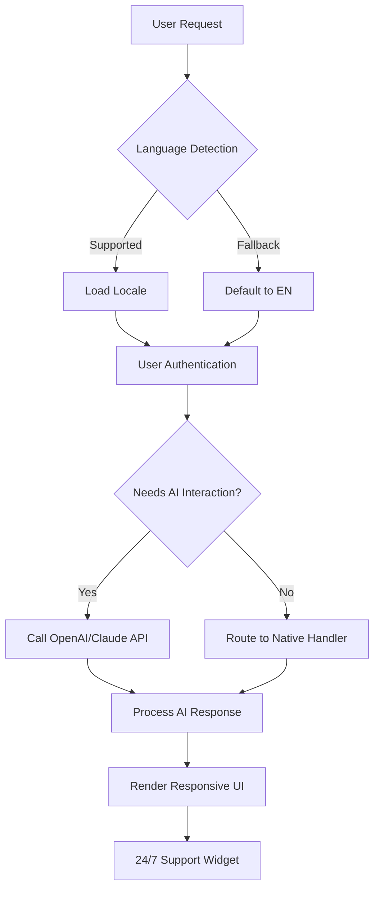

# TurboWebFlow: The Seamless Flow-Driven Web App Builder 🌊

**Create dynamic, multilingual, and responsive web platforms in record time. Automate powerful workflows. Integrate with AI for smarter user experiences.**

---

> **TurboWebFlow** transforms the way you build interactive web applications, introducing a modular flow-based design paradigm for responsive, maintainable, and modern digital experiences. With deep integration to cutting-edge AI APIs (OpenAI, Claude), seamless multilingual support, and always-on customer care, TurboWebFlow is poised to be your development journey’s trusted co-pilot through 2026 and beyond.

---

### 📣 Table of Contents

1. Overview 🚀  
2. Feature Showcase 🌟  
3. SEO Optimized Advantage 📈  
4. OS Compatibility Table 🖥️  
5. Quickstart: Example Console Invocation 🏁  
6. Profile Configuration Example 🔧  
7. Mermaid Diagram: App Workflow 🎨  
8. AI Integrations: OpenAI & Claude 🤖  
9. Responsive, Multilingual, and Support Features 🌐  
10. Disclaimer and Guidelines ⚖️  
11. License 📝  
12. Download & Badge 📥

---

## 1. Overview 🚀

TurboWebFlow reinvents the general-purpose web framework with a “flow designer” mindset. Rather than piecing together static routes, you orchestrate your application as a series of dynamic flows: data, logic, user interactions, and third-party integrations streaming like a powerful river toward your desired outcome.

**Perfect for:**
- Rapid web MVP prototyping
- Enterprise digital transformation
- AI-driven interfaces
- Seamless multi-device, multi-language experiences

By championing configuration-first principles and abstracting complexity, TurboWebFlow empowers teams to ship, iterate, and maintain web apps at the speed of light.

---

## 2. Feature Showcase 🌟

- **Flow-Based Architecture**: Compose applications as interconnected modules (“blocks”) in a flow, automating data transformation and user interaction.
- **Visual Flow Editor**: GUI designer lets you build, edit, and visualize app logic in real-time.
- **True Multilingual Localization**: Out-of-the-box support for 50+ languages with one configuration change.
- **Responsive UI Components**: Powered by a next-gen design system – scale from mobile to ultra-wide with no sweat.
- **AI Chat & Automation**: Seamless OpenAI and Claude integration – custom chatbots, content generation, and smart input validation.
- **Nonstop Customer Support**: Integrated 24/7 virtual agent for visitors and admin users alike.
- **Flow Marketplace**: Discover and import reusable flows created by the community.
- **SEO-Ready Architecture**: Built-in server-side rendering (SSR), dynamic Open Graph tags, sitemaps, and semantic markup.
- **Instant Deploy**: CLI deploys to most cloud platforms or on-premise servers.
- **Granular Profile Management**: Nested, versioned profiles to support dev, staging, production, and custom environments.

---

## 3. SEO Optimized Advantage 📈

TurboWebFlow is engineered with holistic SEO strategies built-in:
- **Meta-data Automation**: Auto-generates meta tags per route and language.
- **Schema Markup**: Enrich every page with proper [JSON-LD](https://schema.org/) snippets for ultimate snippet potential.
- **Semantic Content**: Encourages best practices: headings, alt attributes, and ARIA standards.

**TurboWebFlow is your vehicle to climb search rankings with efficiency and technical verve.**

---

## 4. Emoji OS Compatibility Table 🖥️

| OS / Browser        | 🌐 Supported | 🏆 Advanced Features | 💡 Notes      |
|---------------------|:-----------:|:-------------------:|:-------------|
| Windows 10/11       | ✔️          | ✔️                  | N/A          |
| macOS (Catalina+)   | ✔️          | ✔️                  | N/A          |
| Linux (Debian/Arch) | ✔️          | ✔️                  | N/A          |
| Android 10+         | ✔️          | ✔️                  | Fully tested |
| iOS 13+             | ✔️          | ✔️                  | Fully tested |
| Chrome              | ✔️          | ✔️                  |              |
| Firefox             | ✔️          | ✔️                  |              |
| Safari              | ✔️          | ✔️                  |              |
| Edge                | ✔️          | ✔️                  |              |

**Modern browsers and devices, tested for pixel-perfect experiences.**

---

## 5. Quickstart: Example Console Invocation 🏁

Start a new project:

    turbowebflow new my-awesome-app

Start local development server with staging profile and verbose logging:

    turbowebflow start --profile=staging --locale=de --verbose

Deploy to cloud with built-in commands:

    turbowebflow deploy --target=cloud --profile=production

---

## 6. Profile Configuration Example 🔧

Below is a sample project profile, illustrating the clean configuration philosophy:

    profile: production
    server:
      host: 0.0.0.0
      port: 443
      ssl: true
    localization:
      defaultLocale: en
      supportedLocales:
        - en
        - es
        - fr
        - zh
    ai:
      provider: openai
      key: $OPENAI_API_KEY
      chatbot: enabled
    ui:
      theme: "night-sky"
      responsive: true
    support:
      enabled: true
      virtualAssistant: "Clara"
      escalationEmail: "support@domain.com"

---

## 7. Mermaid Diagram: App Workflow 🎨

Visualizing the flow orchestration for a typical AI-powered multilingual web app:

---

## 8. AI Integrations: OpenAI & Claude 🤖

TurboWebFlow supports direct integration with the world’s most advanced generative AI models:
- **OpenAI API**: GPT-4 and beyond – chatbots, summarization, contextual Q&A, UI copy adaptation.
- **Claude API**: For alternative or hybrid AI capabilities; offers redundancy and model diversity.
- **Secure, Configurable AI Pipelines**: Specify prompts, temperature, safety filters, and logging per workflow “block”.

**Example Magic:**
- Add an AI-powered customer support chat in *minutes*.
- Auto-translate interface or user inputs via API call.
- Customize onboarding based on user intent, dynamically.

---

## 9. Responsive, Multilingual, and Support Features 🌐

**✨ Responsive UI**
- Universal device compatibility.
- Adaptive navigation, gestures, and touch-friendly elements.
- Theming for dark/light modes.

**🌍 Multilingual Superpowers**
- Configure once, get effortless translation across all UI and content routes.
- Supports locale-specific currency, date/time, and legal formatting.

**🕓 Omni-Present Support**
- Modular support widget bakes in customer happiness, with escalation to real humans only if needed.

---

## 10. Disclaimer and Guidelines ⚖️

TurboWebFlow is designed with security and robustness in mind, but as with all web development tools:
- *Production deployments should be audited by your engineering team.*
- Always review and test AI model outputs for appropriateness and accuracy.
- Do not store sensitive user or credential data in configuration profiles unchecked.
- This project may depend on third-party APIs, which can change or become unavailable.
- By using TurboWebFlow, you accept that your AI interactions are bound by the terms and conditions of respective service providers.

_Use responsibly and with creative ambition!_

---

## 11. License 📝

TurboWebFlow is MIT licensed – liberating for use, modification, and collaboration.

[MIT License](https://opensource.org/licenses/MIT) © 2026

---

## 12. Download & Badge 📥

Download the latest stable version:

---

*Let TurboWebFlow carry your boldest web ideas to the digital horizon. Happy building! 🚀*